# TradingClaude — Diseno Organizacional

> Equipo de indicadores tecnicos avanzados y estrategias automatizadas para TradingView.
> Fecha: 2026-02-12 | Fase: Pre-lanzamiento | Modelo: Mixto (free + premium)

---

## 1. Resumen ejecutivo

```
┌─────────────────────────────────────────────────────┐
│              TRADINGCLAUDE — ORG DESIGN              │
├─────────────────────────────────────────────────────┤
│                                                     │
│  Estructura: Founder-led funcional (4 roles)        │
│  Fase: Pre-lanzamiento -> Primer producto en 8 sem  │
│  Modelo: Mixto (free + premium en TradingView)      │
│                                                     │
│  ┌───────────────────────────────────────┐          │
│  │         Founder / Dir. Producto       │          │
│  └──────┬──────────┬──────────┬──────────┘          │
│         │          │          │                      │
│    ┌────▼───┐ ┌────▼───┐ ┌───▼────┐                │
│    │ Quant  │→│  Dev   │→│Community│                │
│    │Strategy│ │PineScript│ │& Growth│                │
│    └────────┘ └────────┘ └───┬────┘                 │
│         ▲                    │                      │
│         └────── feedback ────┘                      │
│                                                     │
│  Ciclo: Research -> Build -> Distribute -> Learn    │
│  Rituales: Lun(planning) Mie(sync) Vie(demo)       │
│  Meta sem 12: 3 scripts live + metricas validadas   │
│                                                     │
└─────────────────────────────────────────────────────┘
```

**Por que esta estructura:**
- **Founder-led** porque en pre-lanzamiento se necesita velocidad de decision (estilo Tesla/Apple en sus inicios).
- **Funcional** porque cada rol es dueno de su area con responsabilidades claras (estilo Google/Amazon).
- **4 roles** porque cubre la cadena completa Research -> Build -> Distribute sin overhead de coordinacion.
- **El 5to rol** se activa al escalar (semana 12+), segun necesidad: Content Creator, QA, o segundo Developer.

---

## 2. Organigrama

```mermaid
graph TD
    F["🎯 Founder / Director de Producto"]
    Q["📊 Quant Strategist"]
    D["💻 Pine Script Developer"]
    C["📢 Community & Growth Lead"]

    F --> Q
    F --> D
    F --> C
    Q -->|specs & senales| D
    D -->|scripts listos| C
    C -->|feedback usuarios| Q

    style F fill:#1a1a2e,stroke:#e94560,color:#fff
    style Q fill:#16213e,stroke:#0f3460,color:#fff
    style D fill:#16213e,stroke:#0f3460,color:#fff
    style C fill:#16213e,stroke:#0f3460,color:#fff
```



### Tipos de relaciones

**Jerarquicas (vertical):**
- Founder -> Quant, Developer, Community (todos reportan directo)
- Estructura plana de un solo nivel, cero mandos medios

**Operativas (horizontal):**

```
Quant ──specs──▶ Developer ──scripts──▶ Community
  ▲                                        │
  └──────────── feedback ──────────────────┘
```

| Paso | De | A | Entregable |
|------|-----|-----|-----------|
| 1. Research | Quant | Developer | Spec de estrategia (logica, parametros, reglas) |
| 2. Build | Developer | Community | Script publicable (codigo, documentacion, inputs) |
| 3. Distribute + Learn | Community | Quant | Feedback de usuarios (que funciona, que piden, que falla) |

**Rol del Founder en el ciclo:** No esta dentro del flujo operativo diario. Interviene en dos momentos:
- **Gate de entrada:** Aprueba que estrategias se priorizan (entre Quant y Developer)
- **Gate de salida:** Aprueba que se publica y con que modelo free/premium (entre Developer y Community)

---

## 3. Descripcion de roles

### 3.1 Founder / Director de Producto

- **Mision:** Definir que se construye, en que orden, y como se monetiza
- **Responsabilidades:**
  - Vision del producto y roadmap de indicadores/estrategias
  - Decisiones de pricing (que es free vs premium)
  - Revision final de calidad antes de publicar
  - Gestion de recursos y prioridades del equipo
  - Relacion con traders clave / early adopters
- **Reporta a:** Nadie (maxima autoridad)
- **Perfil:** Trader con experiencia + vision de negocio. No necesita codear, pero debe entender Pine Script lo suficiente para evaluar viabilidad

### 3.2 Quant Strategist

- **Mision:** Investigar, disenar y validar las estrategias de trading antes de que se codifiquen
- **Responsabilidades:**
  - Research de mercado: que indicadores/estrategias tienen demanda
  - Diseno de logica de senales (entradas, salidas, filtros)
  - Backtesting y validacion estadistica
  - Documentacion de specs tecnicas para el developer
  - Optimizacion de parametros y analisis de riesgo
- **Reporta a:** Founder
- **Perfil:** Background cuantitativo (estadistica, matematicas, finanzas). Conoce mercados y sabe validar edge

### 3.3 Pine Script Developer

- **Mision:** Transformar las estrategias validadas en codigo Pine Script publicable
- **Responsabilidades:**
  - Desarrollo de indicadores y estrategias en Pine Script v5+
  - Optimizacion de rendimiento (evitar repainting, manejar barmerge)
  - UI/UX de los indicadores (colores, inputs, tooltips, tablas)
  - Testing funcional en multiples timeframes y activos
  - Mantenimiento y actualizaciones de scripts publicados
- **Reporta a:** Founder
- **Perfil:** Dominio solido de Pine Script, entiende conceptos de trading tecnico

### 3.4 Community & Growth Lead

- **Mision:** Construir audiencia, convertir usuarios free en premium, y ser la voz del equipo
- **Responsabilidades:**
  - Gestion del perfil de TradingView (publicaciones, ideas, scripts)
  - Creacion de contenido educativo (tutoriales, videos, ideas de trading)
  - Soporte a usuarios y recoleccion de feedback
  - Estrategia de adquisicion (redes sociales, foros, colaboraciones)
  - Reportes de metricas: likes, seguidores, conversiones free->premium
- **Reporta a:** Founder
- **Perfil:** Comunicador con conocimiento de trading, manejo de redes y comunidades

---

## 4. Matriz RACI

**R** = Responsable | **A** = Aprueba | **C** = Consultado | **I** = Informado

### Fase de Research

| Actividad | Founder | Quant | Developer | Community |
|-----------|:-------:|:-----:|:---------:|:---------:|
| Identificar oportunidad de mercado | A | R | I | C |
| Disenar logica de estrategia | A | R | C | I |
| Backtesting y validacion | I | R | C | - |
| Escribir spec tecnica | A | R | I | - |
| Priorizar que se construye | R | C | C | C |

### Fase de Build

| Actividad | Founder | Quant | Developer | Community |
|-----------|:-------:|:-----:|:---------:|:---------:|
| Codificar indicador/estrategia | I | C | R | - |
| Testing multi-timeframe/activo | - | C | R | - |
| Diseno UI del indicador | A | - | R | C |
| Code review / anti-repainting | A | C | R | - |
| Documentacion tecnica del script | I | - | R | C |

### Fase de Distribute

| Actividad | Founder | Quant | Developer | Community |
|-----------|:-------:|:-----:|:---------:|:---------:|
| Decidir modelo free vs premium | R | C | I | C |
| Publicar script en TradingView | A | - | C | R |
| Crear contenido educativo | I | C | - | R |
| Gestionar accesos premium | A | - | - | R |
| Recopilar feedback de usuarios | I | I | I | R |

### Fase Transversal

| Actividad | Founder | Quant | Developer | Community |
|-----------|:-------:|:-----:|:---------:|:---------:|
| Definir roadmap trimestral | R | C | C | C |
| Metricas y KPIs del equipo | R | I | I | C |
| Resolucion de bugs/issues | I | C | R | C |
| Iterar estrategia por feedback | A | R | C | C |

### Lectura rapida

- **Founder:** Mucho **A** y poco **R** — su trabajo es desbloquear, no hacer
- **Quant:** **R** en todo lo de research, **C** en build — valida que lo construido refleje la spec
- **Developer:** **R** en todo lo de build — es dueno del codigo
- **Community:** **R** en distribucion, **C** frecuente — es la voz del usuario dentro del equipo

---

## 5. Rituales de comunicacion

### Cadencia semanal

```
Lunes          Miercoles        Viernes
  │                │                │
  ▼                ▼                ▼
Weekly           Sync            Demo &
Planning        Tecnico          Review
(30 min)        (20 min)        (30 min)
Todo el         Quant +         Todo el
equipo          Developer       equipo
```

### 5.1 Weekly Planning (Lunes, 30 min)

- **Quien:** Todo el equipo
- **Objetivo:** Alinear prioridades de la semana
- **Agenda fija:**
  - Founder: prioridades y decisiones pendientes (5 min)
  - Quant: estado de research en curso (5 min)
  - Developer: estado de builds y blockers (5 min)
  - Community: metricas + feedback destacado de usuarios (5 min)
  - Asignacion de prioridades de la semana (10 min)
- **Output:** Lista de compromisos semanales por rol

### 5.2 Sync Tecnico (Miercoles, 20 min)

- **Quien:** Quant + Developer (Founder opcional)
- **Objetivo:** Asegurar que la spec se traduce correctamente a codigo
- **Agenda fija:**
  - Revisar spec en curso: dudas de implementacion? (10 min)
  - Validar comportamiento del script vs spec (10 min)
- **Output:** Decisiones tecnicas documentadas

### 5.3 Demo & Review (Viernes, 30 min)

- **Quien:** Todo el equipo
- **Objetivo:** Ver lo construido, decidir si se publica
- **Agenda fija:**
  - Developer presenta el indicador/estrategia funcionando (10 min)
  - Quant valida senales y logica (5 min)
  - Community evalua claridad para el usuario final (5 min)
  - Founder: go/no-go de publicacion (5 min)
  - Retrospectiva rapida: que mejorar la proxima semana (5 min)
- **Output:** Decision de publicacion + mejoras pendientes

### 5.4 Comunicacion asincrona

| Canal | Uso | Herramienta sugerida |
|-------|-----|---------------------|
| **General** | Anuncios, decisiones, links | Slack / Discord #general |
| **Research** | Specs, papers, ideas de estrategias | Slack / Discord #research |
| **Dev** | Codigo, bugs, PRs, dudas tecnicas | Slack / Discord #dev |
| **Feedback** | Comentarios de usuarios, metricas | Slack / Discord #feedback |
| **Urgente** | Bugs en produccion, caidas | Mensajes directos / llamada |

### Regla de oro

> Nada se queda en chat sin resolver mas de 24h. Si un tema no se cierra asincronamente, se escala al siguiente ritual o a una llamada directa de 10 min.

---

## 6. Workflows operativos

### 6.1 De idea a spec validada


**Criterios de validacion del backtest:**
- Win rate > umbral definido por estrategia
- Profit factor > 1.5
- Drawdown maximo aceptable
- Testeado en minimo 2 activos y 2 timeframes
- Sin overfitting (out-of-sample validation)

**Entregable:** Documento de spec con logica, parametros, reglas de entrada/salida, y resultados de backtest

### 6.2 De spec a script publicado


**Checklist pre-publicacion (Developer):**
- [ ] Sin repainting en ningun timeframe
- [ ] Inputs con tooltips descriptivos
- [ ] Colores/estilos claros y configurables
- [ ] Funciona en mercados: crypto, forex, stocks minimo
- [ ] Alertas configuradas correctamente (si aplica)
- [ ] Documentacion inline en el codigo
- [ ] Probado en Pine Script v5+ sin warnings

**Checklist pre-publicacion (Founder):**
- [ ] Clasificacion free/premium definida
- [ ] Descripcion del script aprobada
- [ ] Screenshots/previews listos

### 6.3 De publicacion a iteracion


**Metricas que Community monitorea semanalmente:**

| Metrica | Target inicial |
|---------|---------------|
| Likes por script | >50 primer mes |
| Seguidores del perfil | +20%/mes |
| Comentarios respondidos | <24h respuesta |
| Conversion free->premium | >5% |
| Scripts activos publicados | 1-2 por mes |

**Clasificacion de feedback:**
- **Bug** -> Developer lo resuelve en <48h, sin pasar por ciclo completo
- **Feature request** -> Va al backlog, Founder prioriza en Weekly Planning
- **Mejora de UX** -> Developer lo evalua, si es menor lo aplica directo

---

## 7. Riesgos y mitigaciones

| # | Riesgo | Impacto | Mitigacion |
|---|--------|---------|------------|
| 1 | **Founder como cuello de botella** — Todo pasa por su aprobacion | Alto | Definir criterios claros de go/no-go para que Quant y Dev puedan avanzar sin esperar. Delegar decisiones menores |
| 2 | **Indicadores sin traccion** — Se construye lo que nadie quiere | Alto | Community recopila demanda ANTES de que Quant investigue. Validar ideas con la comunidad antes de invertir en research |
| 3 | **Repainting no detectado** — Se publica un script con senales que cambian retroactivamente | Critico | Checklist obligatorio pre-publicacion. Developer testea con `barstate.isconfirmed`. Quant valida en replay mode |
| 4 | **Dependencia de una persona** — Si el Developer se va, no hay quien codee | Alto | Documentar todo el codigo. Founder mantiene conocimiento basico de Pine Script. Specs del Quant lo suficientemente detalladas para onboardear rapido |
| 5 | **Burnout por multitasking** — En equipo pequeno todos hacen de todo | Medio | RACI estricto. Cada persona es R de su area y solo C en las demas. Respetar la cadencia de rituales sin agregar reuniones extra |

---

## 8. Checklist de implementacion

### Fase 1: Fundacion (Semana 1-2)

**Personas**
- [ ] Founder define su disponibilidad horaria y zona horaria base
- [ ] Definir perfiles de contratacion/busqueda para los 3 roles restantes
- [ ] Decidir modelo de trabajo: full-time, part-time, freelance, o equity
- [ ] Publicar busqueda o activar red de contactos

**Herramientas**
- [ ] Crear cuenta de equipo en TradingView (plan Premium/Pro+)
- [ ] Configurar canal de comunicacion (Discord o Slack) con los 4 canales definidos
- [ ] Repositorio de specs y documentacion (Notion, GitHub, o Google Drive)
- [ ] Sistema de backlog/tareas (Trello, Linear, o Notion board)

**Producto**
- [ ] Founder define la primera estrategia/indicador a construir (MVP)
- [ ] Founder documenta la vision del producto y criterios free vs premium

### Fase 2: Ensamblaje (Semana 3-4)

**Personas**
- [ ] Quant Strategist incorporado y con acceso a herramientas
- [ ] Pine Script Developer incorporado y con acceso a herramientas
- [ ] Community Lead incorporado y con acceso a herramientas
- [ ] Onboarding: cada rol lee la vision del producto, RACI, y workflows

**Rituales**
- [ ] Primer Weekly Planning ejecutado
- [ ] Primer Sync Tecnico ejecutado
- [ ] Primera Demo & Review ejecutada
- [ ] Cadencia de rituales confirmada en calendario compartido

**Alineacion**
- [ ] Cada rol confirma que entiende sus responsabilidades (RACI)
- [ ] Cada rol conoce sus metricas de exito
- [ ] Acuerdo de equipo sobre regla de 24h para resolver temas async

### Fase 3: Primer ciclo (Semana 5-8)

**Research**
- [ ] Quant investiga y disena la spec del primer indicador/estrategia
- [ ] Backtest ejecutado con criterios de validacion definidos
- [ ] Spec aprobada por Founder en Sync Tecnico

**Build**
- [ ] Developer codifica el primer script en Pine Script v5+
- [ ] Checklist pre-publicacion completado al 100%
- [ ] Demo presentada al equipo en Demo & Review
- [ ] Founder da go de publicacion

**Distribute**
- [ ] Primer script publicado en TradingView (free, para validar traccion)
- [ ] Community crea contenido de lanzamiento (idea de trading + tutorial)
- [ ] Primer ciclo de feedback recopilado y clasificado

### Fase 4: Validacion y ajuste (Semana 9-12)

**Producto**
- [ ] Minimo 2-3 scripts publicados (al menos 1 free + 1 premium)
- [ ] Metricas iniciales medidas vs targets definidos
- [ ] Primer iteracion basada en feedback de usuarios completada

**Equipo**
- [ ] Retrospectiva de equipo: los roles estan bien definidos?
- [ ] Los rituales son suficientes o sobran/faltan?
- [ ] El ciclo Research->Build->Distribute fluye sin cuellos de botella?
- [ ] Decision: se necesita un 5to rol? Candidatos:
  - **Content Creator dedicado** — si Community esta saturado
  - **QA / Tester** — si la calidad de scripts es un problema
  - **Segundo Developer** — si hay mas specs que capacidad de build

**Negocio**
- [ ] Modelo de pricing validado con datos reales
- [ ] Pipeline de proximos indicadores/estrategias definido para el siguiente trimestre
- [ ] Decision go/no-go para escalar el equipo

---

## 9. Criterios de exito a 12 semanas

| Metrica | Target |
|---------|--------|
| Scripts publicados | >= 3 (min 1 free + 1 premium) |
| Seguidores TradingView | >= 100 |
| Likes totales | >= 150 |
| Conversion free->premium | >= 5% |
| Ciclo idea->publicacion | <= 3 semanas |
| Rituales ejecutados sin falta | >= 90% |
