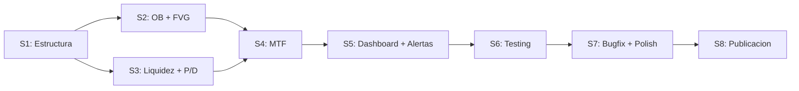

# TradingClaude SMC Suite — Diseno del Primer Indicador

> Suite completa de Smart Money Concepts (SMC/ICT) para TradingView.
> Multi-activo | Multi-timeframe | Anti-repainting | Pine Script v5+
> Fecha: 2026-02-12

---

## 1. Vision del producto

### Que es

Un indicador todo-en-uno de Smart Money Concepts que detecta estructura de mercado, order blocks, fair value gaps, zonas de liquidez y zonas premium/discount, con analisis multi-timeframe, dashboard integrado y alertas inteligentes.

### Posicionamiento

**"La suite SMC mas completa y confiable gratuita en TradingView"**

### Alcance

- **Activos:** Multi-activo (crypto, forex, acciones, indices)
- **Timeframes:** Todos, con analisis multi-timeframe automatico
- **Modelo:** Lanzamiento completo (suite completa desde v1)
- **Distribucion:** Free en TradingView para traccion inicial, premium posterior

---

## 2. Arquitectura de features

```
TradingClaude SMC Suite
│
├── 1. ESTRUCTURA DE MERCADO
│   ├── Swing Highs / Swing Lows (pivots confirmados)
│   ├── BOS (Break of Structure) — continuacion de tendencia
│   ├── CHoCH (Change of Character) — cambio de tendencia
│   └── Trend direction (bullish / bearish / ranging)
│
├── 2. ZONAS INSTITUCIONALES
│   ├── Order Blocks (OB) — ultima vela institucional antes del impulso
│   ├── Fair Value Gaps (FVG) — imbalances / ineficiencias de precio
│   └── Mitigated vs Unmitigated (estado de cada zona)
│
├── 3. LIQUIDEZ
│   ├── Liquidity pools (equal highs / equal lows)
│   ├── Liquidity sweeps (barridos confirmados)
│   └── Buy-side / Sell-side liquidity levels
│
├── 4. PREMIUM / DISCOUNT
│   ├── Equilibrium level (50% del rango)
│   ├── Premium zone (por encima del equilibrio)
│   └── Discount zone (por debajo del equilibrio)
│
├── 5. MULTI-TIMEFRAME (MTF)
│   ├── HTF structure overlay (estructura del TF superior)
│   ├── HTF OB / FVG proyectados en el TF actual
│   └── Confluencia HTF + LTF (senales de alta probabilidad)
│
├── 6. DASHBOARD
│   ├── Tabla en pantalla con estado actual de todos los modulos
│   ├── Trend direction por TF
│   └── Zonas activas cercanas al precio
│
└── 7. ALERTAS
    ├── BOS / CHoCH detectado
    ├── Precio toca Order Block
    ├── FVG llenado / parcialmente llenado
    ├── Liquidity sweep confirmado
    └── Confluencia HTF+LTF activada
```

### Modulos toggle (inputs del usuario)

```
[✓] Show Market Structure (BOS/CHoCH)
[✓] Show Order Blocks
[✓] Show Fair Value Gaps
[✓] Show Liquidity Levels
[✓] Show Premium/Discount Zones
[✓] Show MTF Analysis
[✓] Show Dashboard
HTF Timeframe: [Auto / 15m / 1H / 4H / 1D / 1W / 1M]
Swing Length: [5]
Max Zones to Display: [5]
```

---

## 3. Especificacion tecnica por modulo

### 3.1 Estructura de mercado

**Swing Highs / Swing Lows:**
- Algoritmo: Pivot detection con `ta.pivothigh()` / `ta.pivotlow()` usando swing length configurable
- Confirmacion: Solo se marca despues de N velas de confirmacion (sin repainting)
- Visual: Triangulo pequeno arriba/abajo del swing, con label del precio

**BOS (Break of Structure):**
- Definicion: Precio cierra por encima del ultimo swing high (BOS alcista) o por debajo del ultimo swing low (BOS bajista)
- Condicion: `close > swing_high` (no `high >`, para evitar mechas falsas)
- Visual: Linea horizontal desde el swing roto + label "BOS" con color segun direccion
- Sin repainting: Solo se confirma al cierre de la vela

**CHoCH (Change of Character):**
- Definicion: Primer BOS en direccion contraria a la tendencia actual
- Logica: Si la tendencia es bajista y ocurre un BOS alcista -> CHoCH
- Visual: Igual que BOS pero con label "CHoCH" y color diferenciado (mas prominente)
- Importancia: Es la senal mas relevante — indica posible reversion

**Trend Direction:**
- Bullish: Secuencia de higher highs + higher lows
- Bearish: Secuencia de lower highs + lower lows
- Ranging: Ni HH/HL ni LH/LL claros
- Visual: Color de fondo sutil o barra de estado en el dashboard

### 3.2 Zonas institucionales

**Order Blocks (OB):**
- Definicion: Ultima vela bajista antes de un impulso alcista (bullish OB) o ultima vela alcista antes de un impulso bajista (bearish OB)
- Zona: Se dibuja un `box` desde el open hasta el low de la vela OB (bullish) o del open al high (bearish)
- Estado: `unmitigated` (precio no ha vuelto) -> `mitigated` (precio toca la zona) -> se marca con estilo diferente o se oculta
- Filtro de calidad: Solo OBs que preceden un BOS (no cualquier impulso menor)
- Max zonas: Configurable por input, las mas antiguas se eliminan primero

**Fair Value Gaps (FVG):**
- Definicion: Gap entre la mecha de vela 1 y la mecha de vela 3 (la vela 2 es el impulso)
- Bullish FVG: `low[0] > high[2]` (gap alcista)
- Bearish FVG: `high[0] < low[2]` (gap bajista)
- Visual: `box` semitransparente cubriendo el gap
- Estado: `unfilled` -> `partially filled` -> `filled` (cuando el precio cierra dentro del gap)
- Se actualiza dinamicamente: el box se reduce a medida que se llena

### 3.3 Liquidez

**Liquidity Pools:**
- Equal Highs: 2+ swing highs con precios dentro de un % de tolerancia configurable
- Equal Lows: 2+ swing lows con precios dentro de un % de tolerancia
- Visual: Linea punteada horizontal en el nivel, con label "BSL" (buy-side liquidity) o "SSL" (sell-side liquidity)

**Liquidity Sweeps:**
- Definicion: Precio rompe un nivel de liquidez con mecha pero cierra de vuelta por debajo/encima
- Condicion bullish sweep: `low < SSL_level` AND `close > SSL_level`
- Condicion bearish sweep: `high > BSL_level` AND `close < BSL_level`
- Visual: Icono o label "SWEEP" en la vela que ejecuta el barrido
- Importancia: Senal de alta probabilidad cuando confluye con OB o FVG

### 3.4 Premium / Discount

**Calculo:**
- Rango: Desde el swing low mas reciente relevante hasta el swing high mas reciente relevante
- Equilibrium: `(swing_high + swing_low) / 2`
- Premium: Zona por encima del equilibrium (vender)
- Discount: Zona por debajo del equilibrium (comprar)

**Visual:**
- Background color sutil: rojo tenue en premium, verde tenue en discount
- Linea de equilibrium punteada al 50%
- Opcional: Niveles Fibonacci (0.618, 0.705, 0.786) como sub-zonas dentro de premium/discount

### 3.5 Multi-Timeframe (MTF)

**Implementacion:**
- Usa `request.security()` para obtener datos del HTF seleccionado
- Calcula estructura de mercado (swings, BOS, CHoCH) en el HTF
- Proyecta OBs y FVGs del HTF como zonas en el grafico actual

**Auto-deteccion de HTF:**

| TF actual | HTF automatico |
|-----------|---------------|
| 1m - 5m | 1H |
| 15m | 1H |
| 1H | 4H |
| 4H | 1D |
| 1D | 1W |
| 1W | 1M |

**Visual:**
- Zonas HTF con borde mas grueso y estilo diferenciado (para distinguir de las LTF)
- Label con prefijo del TF: "[4H] OB", "[1D] FVG"
- Confluencia: Cuando una zona LTF coincide con una zona HTF, se marca con un indicador especial

---

## 4. Dashboard

### Layout

```
┌─────────────────────────────────────────┐
│         TRADINGCLAUDE SMC SUITE         │
├─────────────────────────────────────────┤
│                                         │
│  Trend     LTF: 🟢 Bullish             │
│            HTF: 🔴 Bearish             │
│                                         │
│  Structure Last BOS: 1.0845 (Bull)     │
│            Last CHoCH: 1.0790 (Bear)   │
│                                         │
│  Zones     OB:  2 active (1 HTF)       │
│            FVG: 3 active (1 HTF)       │
│                                         │
│  Liquidity BSL: 1.0900                 │
│            SSL: 1.0750                 │
│                                         │
│  Position  🟢 Discount (38.2%)         │
│            EQ: 1.0825                  │
│                                         │
│  Signal    ⚡ OB + FVG confluence      │
│            at 1.0800 (HTF aligned)     │
│                                         │
└─────────────────────────────────────────┘
```

**Implementacion tecnica:**
- Usa `table.new()` de Pine Script v5
- Cada fila es una celda con `table.cell()`
- Colores dinamicos: verde para bullish, rojo para bearish, gris para neutral
- Se actualiza en cada vela confirmada
- Configurable: el usuario puede ocultar filas que no quiera ver

**Inputs del dashboard:**

```
Dashboard Position: [Top Right / Top Left / Bottom Right / Bottom Left]
Show Trend Row: [true]
Show Structure Row: [true]
Show Zones Row: [true]
Show Liquidity Row: [true]
Show Position Row: [true]
Show Signal Row: [true]
Dashboard Size: [Small / Normal / Large]
```

---

## 5. Sistema de alertas

### Categorias de alertas

| # | Alerta | Condicion | Prioridad |
|---|--------|-----------|-----------|
| 1 | **BOS Bullish** | Close rompe ultimo swing high | Media |
| 2 | **BOS Bearish** | Close rompe ultimo swing low | Media |
| 3 | **CHoCH Bullish** | Primer BOS alcista en tendencia bajista | Alta |
| 4 | **CHoCH Bearish** | Primer BOS bajista en tendencia alcista | Alta |
| 5 | **OB Touch** | Precio entra en zona de order block unmitigated | Alta |
| 6 | **FVG Fill** | Precio cierra dentro de un FVG unfilled | Media |
| 7 | **Liquidity Sweep** | Mecha barre nivel + cierre de vuelta | Alta |
| 8 | **HTF+LTF Confluence** | Senal LTF alineada con zona HTF | Muy alta |
| 9 | **Premium Zone Entry** | Precio entra en zona premium (>50% rango) | Baja |
| 10 | **Discount Zone Entry** | Precio entra en zona discount (<50% rango) | Baja |

### Implementacion

```pinescript
// Cada alerta usa alertcondition() para configuracion individual
alertcondition(bos_bull, "BOS Bullish", "BOS Bullish detected at {{close}}")
alertcondition(bos_bear, "BOS Bearish", "BOS Bearish detected at {{close}}")
alertcondition(choch_bull, "CHoCH Bullish", "CHoCH Bullish at {{close}} - Trend reversal")
// ... etc para cada una
```

### Mensaje de alerta (formato estandar)

```
🎯 TradingClaude SMC Suite
Signal: CHoCH Bullish
Price: {{close}}
Timeframe: {{interval}}
HTF Trend: Bearish
Action: Potential long setup in discount zone
```

### Alerta compuesta (confluencia)

- Cuando 2+ senales ocurren en la misma vela, se genera una alerta de confluencia
- Ejemplo: OB Touch + Discount Zone + HTF aligned = alerta de maxima probabilidad
- Usa `alert()` (no `alertcondition()`) para mensajes dinamicos con contexto completo

### Inputs de alertas

```
Enable BOS Alerts: [true]
Enable CHoCH Alerts: [true]
Enable OB Alerts: [true]
Enable FVG Alerts: [true]
Enable Liquidity Alerts: [true]
Enable Confluence Alerts: [true]
Enable Premium/Discount Alerts: [false]
Alert Message Format: [Simple / Detailed]
```

---

## 6. UI/UX y paleta visual

### Filosofia de diseno

**Principio:** El grafico es del trader, no del indicador. El indicador debe informar sin saturar.

- Zonas semitransparentes que no oculten el precio
- Colores consistentes por concepto (bullish siempre verde, bearish siempre rojo)
- Labels concisos — maximo 3-4 caracteres en el grafico
- Todo configurable: si al trader no le gusta un elemento, lo apaga

### Paleta de colores

```
BULLISH                          BEARISH
─────────────────────────────    ─────────────────────────────
#089981  Senales (BOS/CHoCH)     #F23645  Senales (BOS/CHoCH)
#089981  Order Blocks (20%)      #F23645  Order Blocks (20%)
         opacity                          opacity
#2962FF  FVG (15% opacity)       #FF6D00  FVG (15% opacity)
#00BCD4  Liquidity levels        #FF5252  Liquidity levels

NEUTRAL
─────────────────────────────
#787B86  Swing points / labels
#363A45  Dashboard background
#D1D4DC  Dashboard text
#2962FF  Equilibrium line
#26A69A  Discount zone (8% opacity)
#EF5350  Premium zone (8% opacity)

HTF (diferenciacion)
─────────────────────────────
Mismo color que LTF pero:
  - Borde 2px mas grueso
  - Opacity +10%
  - Label con prefijo [HTF]
```

**Nota:** Los colores `#089981` y `#F23645` son los verdes/rojos nativos de TradingView.

### Elementos visuales por modulo

**1. Swings:**
- Tamano: `size.tiny`
- Color: `#787B86` (gris neutro)
- Label: "HH", "HL", "LH", "LL" segun secuencia

**2. BOS / CHoCH:**
- BOS: `line.style_dashed`, ancho 1
- CHoCH: `line.style_solid`, ancho 2
- Label al final de la linea con direccion

**3. Order Blocks:**
- `box.new()` con `bgcolor` al 20% opacity
- Borde solido 1px del color correspondiente
- Se extiende hacia la derecha hasta ser mitigado
- Mitigado: borde cambia a estilo dotted + opacity baja a 5%

**4. FVG:**
- Borde `line.style_dotted` para diferenciar de OBs
- 15% opacity, color azul (bull) / naranja (bear)
- Se reduce dinamicamente cuando el precio llena parte del gap

**5. Liquidity:**
- `line.style_dotted`, ancho 1
- Color cyan (BSL) / rojo claro (SSL)
- Sweep confirmado: se marca con "x" en el punto de barrido

**6. Premium/Discount:**
- `bgcolor` condicional basado en posicion del precio
- Linea EQ: `line.style_dashed`, color `#2962FF`

### Inputs de personalizacion visual

```
// Colores
Bullish Color: [#089981]
Bearish Color: [#F23645]
FVG Bullish Color: [#2962FF]
FVG Bearish Color: [#FF6D00]

// Opacidad
OB Opacity: [20]
FVG Opacity: [15]
Premium/Discount Opacity: [8]

// Tamanos
Label Size: [Tiny / Small / Normal]
Line Width: [1 / 2 / 3]
Zone Extension (bars): [50]

// Limpieza
Max OBs to Show: [5]
Max FVGs to Show: [5]
Hide Mitigated Zones: [false]
```

---

## 7. Arquitectura de codigo

### Estructura del script

```
TradingClaude_SMC_Suite.pine
│
├── HEADER
│   ├── indicator() declaration
│   ├── Version & license
│   └── Constants
│
├── INPUTS (Grupo 1-8)
│   ├── G1: Market Structure settings
│   ├── G2: Order Blocks settings
│   ├── G3: FVG settings
│   ├── G4: Liquidity settings
│   ├── G5: Premium/Discount settings
│   ├── G6: MTF settings
│   ├── G7: Dashboard settings
│   └── G8: Alerts settings
│
├── FUNCTIONS (utilidades reutilizables)
│   ├── f_detectSwings()
│   ├── f_detectBOS()
│   ├── f_detectCHoCH()
│   ├── f_findOrderBlocks()
│   ├── f_findFVG()
│   ├── f_findLiquidity()
│   ├── f_calcPremiumDiscount()
│   ├── f_drawBox()
│   ├── f_drawLine()
│   └── f_drawLabel()
│
├── CORE LOGIC
│   ├── // 1. Swing detection (LTF)
│   ├── // 2. Structure (BOS/CHoCH)
│   ├── // 3. Order Blocks
│   ├── // 4. FVG
│   ├── // 5. Liquidity
│   ├── // 6. Premium/Discount
│   ├── // 7. MTF (request.security calls)
│   └── // 8. Confluence detection
│
├── RENDERING
│   ├── // Draw zones (boxes)
│   ├── // Draw structure (lines + labels)
│   ├── // Draw liquidity (lines)
│   ├── // Draw premium/discount (bgcolor)
│   ├── // Draw dashboard (table)
│   └── // Cleanup old objects
│
└── ALERTS
    ├── alertcondition() per signal
    └── alert() for confluence
```

### Declaracion del indicador

```pinescript
//@version=5
indicator("TradingClaude SMC Suite", "TC-SMC",
          overlay    = true,
          max_lines  = 500,
          max_boxes  = 500,
          max_labels = 500)
```

### Estrategia anti-repainting

**Regla global:** Toda senal se confirma SOLO al cierre de la vela. Nunca en tiempo real.

| Modulo | Riesgo de repainting | Solucion |
|--------|---------------------|----------|
| Swings | Alto — `ta.pivothigh/low` repinta por naturaleza | Usar offset fijo: la senal se dibuja N velas atras, donde N = swing length. El swing se confirma cuando las N velas posteriores no lo invalidan |
| BOS/CHoCH | Medio — depende de si se usa `high/low` o `close` | Condicion estricta: `close > swing_high` (no `high`). Solo se marca al cierre confirmado con `barstate.isconfirmed` |
| Order Blocks | Bajo — se calculan retrospectivamente | Se dibuja el OB solo despues de confirmar el BOS que lo valida. No se dibuja "en anticipacion" |
| FVG | Bajo — son gaps historicos | Se detecta en vela [0] mirando [1] y [2]. Ya confirmado por definicion |
| Liquidity | Medio — equal highs/lows pueden cambiar | Se recalcula solo en velas confirmadas. Niveles se fijan una vez detectados |
| MTF | Alto — `request.security()` puede repintar | Usar `barmerge.lookahead_off` siempre. Pasar `close[1]` en vez de `close` cuando sea necesario |

**Codigo anti-repainting MTF:**

```pinescript
// CORRECTO - sin repainting
htf_close = request.security(syminfo.tickerid, htf_tf, close[1],
             barmerge.gaps_off, barmerge.lookahead_on)

// INCORRECTO - repinta
htf_close = request.security(syminfo.tickerid, htf_tf, close)
```

**Guard global en cada calculo:**

```pinescript
// Envolver toda logica de senales en esta condicion
if barstate.isconfirmed
    // ... detectar swings, BOS, CHoCH, etc.
```

### Gestion de objetos graficos

Pine Script tiene limite de ~500 objetos por tipo (lines, boxes, labels).

| Objeto | Limite interno | Comportamiento al exceder |
|--------|---------------|--------------------------|
| Boxes (OB) | max_obs input | Elimina el OB mas antiguo |
| Boxes (FVG) | max_fvgs input | Elimina el FVG mas antiguo |
| Lines (BOS) | 50 | Elimina la linea mas antigua |
| Lines (Liq) | 20 | Elimina el nivel mas antiguo |
| Labels | 100 | Elimina el label mas antiguo |
| Table | 1 (dashboard) | Se actualiza, no se recrea |

**Implementacion:**

```pinescript
// Array para trackear OBs activos
var box[] ob_boxes = array.new_box()

// Al crear nuevo OB
if array.size(ob_boxes) >= max_obs
    box.delete(array.shift(ob_boxes))  // elimina el mas viejo
array.push(ob_boxes, box.new(...))     // agrega el nuevo
```

### Manejo de estados con arrays

```pinescript
// Cada zona tiene un estado trackeable
var int[]   ob_states    = array.new_int()     // 0=unmitigated, 1=mitigated
var float[] ob_tops      = array.new_float()   // precio superior del OB
var float[] ob_bottoms   = array.new_float()   // precio inferior del OB
var box[]   ob_boxes     = array.new_box()     // objeto grafico

// En cada vela confirmada: verificar si el precio mitigo algun OB
if barstate.isconfirmed
    for i = array.size(ob_states) - 1 to 0
        if array.get(ob_states, i) == 0  // unmitigated
            if low <= array.get(ob_tops, i) and high >= array.get(ob_bottoms, i)
                array.set(ob_states, i, 1)  // marcar como mitigated
                // actualizar visual del box
```

---

## 8. Plan de testing

### Activos de prueba

| Mercado | Activo | Caracteristica |
|---------|--------|---------------|
| Crypto | BTCUSDT | Alta volatilidad, 24/7, mechas largas |
| Crypto | ETHUSDT | Correlacion con BTC, gaps en futuros |
| Forex | EURUSD | Baja volatilidad relativa, sesiones definidas |
| Forex | GBPJPY | Alta volatilidad en forex, movimientos rapidos |
| Acciones | AAPL | Gaps de apertura, horario limitado |
| Indices | SPX | Referencia institucional, alta liquidez |

### Timeframes de prueba

| TF | Proposito |
|----|-----------|
| 1m | Estres — maximo volumen de senales y objetos |
| 15m | Intraday tipico — caso de uso principal |
| 1H | Balance senales/calidad |
| 4H | Swing trading — zonas mas amplias |
| 1D | Posicional — pocas senales, deben ser precisas |
| 1W | Edge case — minimo de datos, MTF con 1M |

### Tests por modulo

**Modulo 1: Estructura de mercado**

| Test | Metodo | Criterio de aceptacion |
|------|--------|----------------------|
| Swings no repintan | Activar replay mode, avanzar vela por vela | Un swing marcado NUNCA desaparece ni se mueve |
| BOS se confirma al cierre | Observar vela en tiempo real que rompe swing | La senal aparece SOLO despues del cierre, no durante |
| CHoCH detecta reversiones correctamente | Comparar con analisis manual en 20 puntos | >=90% coincidencia con analisis manual |
| Trend direction es coherente | Verificar secuencia HH/HL vs LH/LL | No hay contradicciones |

**Modulo 2: Zonas institucionales**

| Test | Metodo | Criterio de aceptacion |
|------|--------|----------------------|
| OB se dibuja solo despues de BOS | Verificar que no hay OBs sin BOS posterior | 100% de OBs tienen un BOS que los valida |
| OB mitigation se detecta | Precio toca zona de OB | Estado cambia a mitigated, visual se actualiza |
| FVG se calcula correctamente | Comparar gap manual vs indicador en 15 casos | 100% coincidencia |
| FVG fill tracking funciona | Precio llena parcial/totalmente un FVG | Box se reduce o marca como filled |

**Modulo 3: Liquidez**

| Test | Metodo | Criterio de aceptacion |
|------|--------|----------------------|
| Equal highs/lows detectados | Verificar visualmente en 10 casos por activo | Tolerancia configurable funciona correctamente |
| Sweeps no dan falsos positivos | Revisar ultimos 50 sweeps detectados | >=85% son sweeps legitimos |
| Labels BSL/SSL posicionados correctamente | Inspeccion visual | Labels no se solapan, precio es correcto |

**Modulo 4: Premium/Discount**

| Test | Metodo | Criterio de aceptacion |
|------|--------|----------------------|
| Equilibrium calculado correctamente | Manual vs indicador | 100% coincidencia |
| Zonas se actualizan con nuevos swings | Nuevo swing high/low cambia el rango | Rango se recalcula, zonas se redibujan |
| Bgcolor no satura el grafico | Inspeccion visual en multiples TFs | Opacity es sutil, precio sigue siendo legible |

**Modulo 5: MTF**

| Test | Metodo | Criterio de aceptacion |
|------|--------|----------------------|
| Sin repainting en request.security | Replay mode, comparar senales HTF | Senales HTF son identicas en replay vs historico |
| Auto-deteccion de HTF | Cambiar TF del grafico, verificar HTF seleccionado | Mapeo coincide con tabla definida |
| Zonas HTF se diferencian visualmente | Inspeccion visual: LTF vs HTF | Borde mas grueso + label con prefijo [HTF] visible |
| HTF no genera objetos excesivos | Abrir en 1m con HTF 1H | No excede limites de Pine Script |

**Modulo 6: Dashboard**

| Test | Metodo | Criterio de aceptacion |
|------|--------|----------------------|
| Datos son correctos | Comparar cada celda con calculo manual | 100% coincidencia |
| Posicion configurable funciona | Cambiar input a cada esquina | Dashboard se reposiciona correctamente |
| No afecta rendimiento | Medir tiempo de carga con y sin dashboard | Diferencia <10% en tiempo de render |
| Responsive en diferentes resoluciones | Probar en pantalla completa y ventana pequena | Texto legible, no se corta |

**Modulo 7: Alertas**

| Test | Metodo | Criterio de aceptacion |
|------|--------|----------------------|
| Cada alertcondition se dispara | Configurar alerta, esperar senal en 15m BTCUSDT | Notificacion recibida en <5 segundos |
| Mensaje contiene datos correctos | Revisar texto de la alerta | Precio, TF, tipo de senal correctos |
| Confluencia detecta 2+ senales | Simular vela con OB touch + discount zone | Alerta compuesta se genera correctamente |
| No hay alertas duplicadas | Monitorear durante 24h en 15m | Cada evento genera exactamente 1 alerta |

### Test de estres

| Escenario | Condicion | Criterio |
|-----------|-----------|----------|
| **Maximos objetos** | 1m BTCUSDT, todos los modulos activos | No crash, no errores, <500 por tipo |
| **Datos minimos** | 1W en activo con poco historial | No errores, se adapta a datos disponibles |
| **Cambio rapido de TF** | Alternar entre 1m -> 1D -> 5m rapidamente | Indicador recalcula sin artefactos visuales |
| **Todos los inputs desactivados** | Desactivar los 7 modulos | Grafico limpio, sin errores, sin objetos residuales |
| **Todos los inputs activados** | Maximas zonas, maximos labels | Rendimiento aceptable (<3 seg de carga) |

### Criterios de calidad pre-publicacion

```
BLOQUEANTE (no se publica sin resolver):
  ✗ Cualquier caso de repainting confirmado
  ✗ Error de compilacion en Pine Script
  ✗ Crash o timeout en algun activo/TF de prueba
  ✗ Alerta que no se dispara cuando deberia
  ✗ Datos incorrectos en el dashboard

IMPORTANTE (se debe resolver antes del release):
  △ Solapamiento visual excesivo entre modulos
  △ Rendimiento >5 seg en algun escenario de prueba
  △ Label o texto cortado en alguna resolucion
  △ Falsos positivos >15% en liquidity sweeps

MENOR (puede ir a backlog post-release):
  ○ Ajustes esteticos de colores u opacidad
  ○ Mejoras de wording en mensajes de alerta
  ○ Optimizaciones de rendimiento menores
```

---

## 9. Timeline de desarrollo (8 semanas)

```
Semana 1        Semana 2        Semana 3        Semana 4
────────        ────────        ────────        ────────
Setup +         Order Blocks    Liquidity +     MTF
Estructura      + FVG           Premium/Disc    Integration
de mercado

- Repo Pine     - OB detection  - Equal H/L     - request.security
- Inputs base   - OB mitigation - Sweep detect     setup
- f_swings()    - FVG detection - BSL/SSL labels - HTF structure
- BOS/CHoCH     - FVG fill      - EQ/Premium/   - HTF zones en
- Trend logic     tracking        Discount calc    grafico LTF
- Labels/lines  - Box rendering - bgcolor zones  - Auto-detect TF
                                                 - Confluencia

Semana 5        Semana 6        Semana 7        Semana 8
────────        ────────        ────────        ────────
Dashboard +     Testing         Bugfix +        Publicacion
Alertas         completo        Polish

- table.new()   - 6 activos x   - Fix issues    - Descripcion
- Dashboard       6 TFs           bloqueantes     TradingView
  dinamico      - Anti-repaint  - UI/UX polish  - Screenshots
- 10 alert        verification  - Optimizar     - Tutorial
  conditions    - Stress test     rendimiento   - Contenido de
- Confluencia   - Replay mode   - Code cleanup    lanzamiento
  alerts          testing       - Inputs final  - GO/NO-GO
                - Log issues    - Re-test         Founder
```

### Dependencias entre semanas



**Camino critico:** S1 -> S2 -> S4 -> S5 -> S6 -> S7 -> S8

S2 y S3 pueden desarrollarse en paralelo si hay capacidad, pero S4 (MTF) requiere que ambos esten terminados.

### Roles por semana

| Semana | Quant | Developer | Community | Founder |
|--------|-------|-----------|-----------|---------|
| 1 | Spec estructura de mercado, definir swing logic | Setup repo, codificar modulo 1 | Research competidores en TradingView | Aprobar spec, definir inputs |
| 2 | Spec OB + FVG, criterios de validacion | Codificar modulo 2 | Documentar features para contenido futuro | Review avance |
| 3 | Spec liquidez + premium/discount | Codificar modulo 3 | Preparar perfil TradingView | Review avance |
| 4 | Spec MTF, definir confluencias | Codificar modulo 5 (MTF) | Disenar plan de lanzamiento | Review avance, aprobar confluencias |
| 5 | Definir mensajes de alerta | Codificar modulo 6 + 7 (dashboard + alertas) | Crear borrador de tutorial | Review dashboard layout |
| 6 | Ejecutar backtests de validacion | Soporte en testing, fix bugs | Testing de UX como usuario final | Asistir en testing critico |
| 7 | Validar senales post-fix | Fix bugs bloqueantes, polish | Preparar screenshots y descripcion | Go/no-go preliminar |
| 8 | Validacion final de senales | Deploy final, ultimos ajustes | Publicar contenido de lanzamiento | **GO/NO-GO final** |

---

## 10. Riesgos del desarrollo

| # | Riesgo | Probabilidad | Impacto | Mitigacion |
|---|--------|:------------:|:-------:|------------|
| 1 | **Limite de objetos Pine Script** — 500 boxes/lines no alcanzan con todos los modulos activos en 1m | Alta | Critico | Limits estrictos por input. Cleanup agresivo de objetos antiguos. Test de estres en semana 6 |
| 2 | **Repainting en MTF** — `request.security()` es la fuente #1 de repainting en Pine Script | Alta | Critico | `barmerge.lookahead_off` + `close[1]` siempre. Verificar en replay mode sin excepcion |
| 3 | **Rendimiento lento** — Suite completa con 7 modulos puede tardar >10 seg en cargar | Media | Alto | Optimizar: no recalcular en cada tick, usar `barstate.isconfirmed`. Limitar max zonas. Profiling en semana 6 |
| 4 | **Complejidad del codigo** — Un solo archivo Pine Script con 7 modulos se vuelve inmanejable | Media | Medio | Funciones modulares con prefijos claros (`f_ob_*`, `f_fvg_*`). Comentarios por seccion. Code review semanal |
| 5 | **Falsas senales de liquidez** — Equal highs/lows con tolerancia incorrecta genera ruido | Media | Medio | Tolerancia configurable por input. Default conservador. Quant valida con 50+ casos en semana 6 |

### Plan de contingencia

```
SI limite de objetos se alcanza:
   -> Reducir defaults (max OBs: 5->3, max FVGs: 5->3)
   -> Implementar priorizacion: zonas cercanas al precio > antiguas

SI rendimiento >5 seg:
   -> Desactivar modulos menos criticos por default
   -> Calcular solo en barstate.isconfirmed (no en cada tick)
   -> Reducir lookback period

SI repainting detectado en testing:
   -> PARAR desarrollo de nuevos features
   -> Fix inmediato del modulo afectado
   -> Re-test completo antes de continuar
```

---

## 11. Analisis competitivo

### Competidores directos en TradingView

| Indicador | Seguidores | Fortaleza | Debilidad |
|-----------|:----------:|-----------|-----------|
| **LuxAlgo SMC** | 50K+ | UI pulida, marca reconocida | De pago, no muestra logica interna |
| **SmartMoneyConcepts (LuxMI)** | 30K+ | Gratuito, amplia comunidad | Repainting reportado, UI saturada |
| **ICT Concepts (tradeseeq)** | 15K+ | Fiel a la metodologia ICT | Falta MTF, dashboard limitado |
| **Market Structure (LeviathanCapital)** | 10K+ | Estructura limpia | Solo estructura, sin OB/FVG/liquidez |

### Ventaja competitiva

```
Lo que TODOS tienen:
  ✓ BOS / CHoCH detection
  ✓ Order Blocks basicos

Lo que ALGUNOS tienen:
  ~ FVG detection (algunos sin fill tracking)
  ~ MTF (pocos lo implementan bien sin repainting)
  ~ Dashboard (mayoria basico o inexistente)

Lo que NINGUNO combina bien:
  ✗ Anti-repainting verificado + MTF + Dashboard + Alertas granulares
  ✗ Confluencia HTF+LTF como senal explicita
  ✗ Todos los modulos toggle con UI limpia
  ✗ Suite completa GRATUITA de alta calidad
```

---

## 12. Criterios de exito

### A 30 dias post-publicacion

| Metrica | Target | Como se mide |
|---------|--------|-------------|
| Likes | >=100 | Pagina del script en TradingView |
| Favoritos | >=200 | Pagina del script en TradingView |
| Comentarios | >=30 | Pagina del script, excluyendo spam |
| Seguidores nuevos | >=150 | Perfil del equipo en TradingView |
| Reportes de repainting | 0 | Comentarios + feedback directo |
| Bugs criticos | <=2 | Comentarios + testing interno |
| Rating en comentarios | >=4.5/5 | Analisis de sentimiento de comentarios |

### A 90 dias post-publicacion

| Metrica | Target | Como se mide |
|---------|--------|-------------|
| Likes acumulados | >=500 | Pagina del script |
| Usuarios activos estimados | >=1000 | Favoritos como proxy |
| Solicitudes de version premium | >=50 | DMs + comentarios pidiendo mas features |
| Ideas de trading publicadas usando el indicador | >=10 | Community las publica en TradingView |
| Posicion en busqueda "SMC" en TradingView | Top 10 | Busqueda manual |

---

## 13. Estrategia de lanzamiento

**Pre-lanzamiento (semana 7-8):**
- Publicar 3-5 ideas de trading en TradingView usando el indicador (sin revelarlo)
- Generar curiosidad: "indicador propio en desarrollo"
- Compartir screenshots en redes con marca de agua sutil

**Dia de lanzamiento:**
- Publicar script como "open source" o "invite-only" segun decision del Founder
- Descripcion del script optimizada con screenshots de cada modulo
- Video tutorial corto (2-3 min) mostrando las features principales
- Publicar idea de trading en vivo usando el indicador

**Post-lanzamiento (semana 9-12):**
- Responder TODOS los comentarios en <24h
- Publicar 2 ideas de trading por semana usando el indicador
- Recopilar feedback y clasificar (bugs vs features vs UX)
- Iterar con patches rapidos para bugs criticos
- Teaser de features premium para generar demanda
